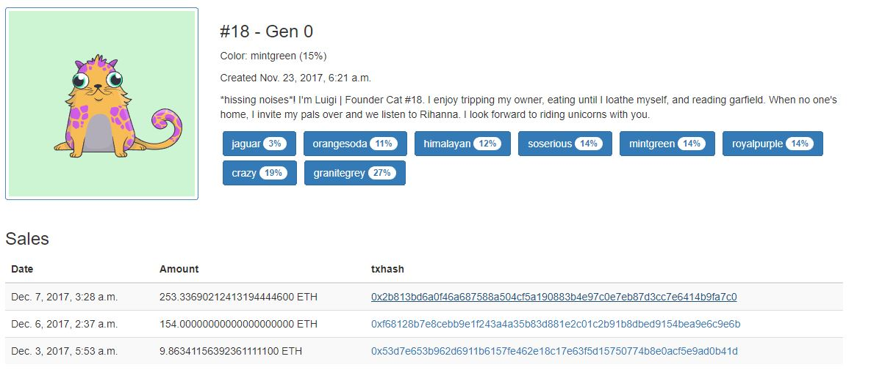
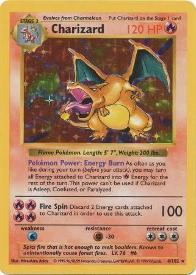

<!--- Title: ERC721 Demystified --->
## Introduction
In this tutorial we'll go over proposed ERC721 standard, explain why it is useful
and show example of ERC721 usage.

The following content is recommended reading before if you plan to follow this tutorial:
* [Solidity Development Crash Course](https://bitfalls.com/2018/03/31/solidity-development-crash-course-building-blockchain-raffle/)
* [How to Run Your Own Private Ethereum Blockchain](https://bitfalls.com/2018/03/31/solidity-development-crash-course-building-blockchain-raffle/)

### ERC721 Motivation
Not a long time ago everybody was taking about a new (and probably one of the first) blockchain based game called [CryptoKitties](https://www.cryptokitties.co/) that used
tokens to represent each <i>CryptoKitty</i> and people went crazy about collecting virtual kittens. Game quickly gained popularity and
in it's peek popularity users even managed to clog the Ethereum Blockchain with transactions
connected to <i>CryptoKitties</i>. Some people made a decent paycheck by breeding and selling their kittens, today some kittens are being sold for ridiculous values, we are talking about hundreds of thousands of dollars for a kitten from the first generation.
You can easily find similarities between <i>CryptoKitties</i> and collectibles like Pokémon cards and sports cards (baseball, football, etc.).

Image bellow shows example of a <i>CryptoKitty</i>, you can see ridiculous sales bellow kitten. Also you can see that each kitten has attributes that makes it unique, this kitten in this example is, among other attributes, jaguar and crazy.

*Founder Cat #18*


Collectible items like <i>CryptoKitties</i> where items differ one from another and each items has it's own uniqueness you have to use tokens that will account for that. In this case each token will have to be distinguished from each other because each token will represent unique item. Here ERC721 comes into play.

### Fungibility
The ERC721 is a proposed interface for non-fungible tokens, so let's first explain what they
mean by saying non-fungible.
>In economics, <b>fungibility</b> is the property of a good or commodity whose individual units are essentially interchangeable. [[Wiki]](https://en.wikipedia.org/wiki/Fungibility)

Ethereum's Ethers are fungible because they are interchangeable, there is no difference between two
Ethers. Same as fiat currencies, let's take dollar as an example, dollar is fungible because if Alice has a $5 bill and Bob has a $5 bill there is no difference between their bills, they can even switch their bills and no one will be at loss or profit. In contrast to Ether, collectibles like Pokémon cards are not fungible because cards are not interchangeable, some cards are worth more then others because of their rarity or individual properties.
>If we take a look at the current market of Pokémon cards we can see that the first edition cards
> are valued more than the cards from the newer editions. In the each edition there are some
> cards that are rarer then other cards and they are the most expensive in their individual editions.
> Some Pokémons are present in multiple editions but they are not fungible because editions differentiate them.
> You can argue that the two identical Pokémon cads are fungible but even then card that is in better physical
> condition is worth more.

 | 
:-----------------------------------------------------:|:---------------------------:
Charizard first edition rare card, [Source](https://www.trollandtoad.com/p907921.html)  |  Diglett first edition common card, [Source](https://www.trollandtoad.com/p907930.html)  

<!--- TODO: Add more examples? --->
---
### Use cases
Now that you hopefully understand the term fungibility we can explain why non-fungible tokens are useful. First use case and probably the one that makes the most sense is implementation any kind of collectables on the blockchain as the non-fungible token, [<i>CryptoKitties</i>](https://www.cryptokitties.co/) is the perfect example of that. Other use cases include examples like [<i>WePower</i>](https://wepower.network/) that is using non-fungible token to represent different types of energy (solar, wind, hydro, etc.). ERC721 standard is allowing us to create non-fungible tokens that can represent such collectibles and commodities on the blockchain.

## ERC721 Interface
Now that we know the idea behind ERC721 tokens we can dive into the proposed interface itself.
The following code is the interface itself (source of the proposed interface can be found [here](https://github.com/ethereum/EIPs/blob/master/EIPS/eip-721.md)):

```javascript
interface ERC721{

    event Transfer(address indexed _from, address indexed _to, uint256 _tokenId);
    event Approval(address indexed _owner, address indexed _approved, uint256 _tokenId);
    event ApprovalForAll(address indexed _owner, address indexed _operator, bool _approved);

    function balanceOf(address _owner) external view returns (uint256);
    function ownerOf(uint256 _tokenId) external view returns (address);
    function safeTransferFrom(address _from, address _to, uint256 _tokenId, bytes data) external payable;
    function safeTransferFrom(address _from, address _to, uint256 _tokenId) external payable;
    function transferFrom(address _from, address _to, uint256 _tokenId) external payable;
    function approve(address _approved, uint256 _tokenId) external payable;
    function setApprovalForAll(address _operator, bool _approved) external;
    function getApproved(uint256 _tokenId) external view returns (address);
    function isApprovedForAll(address _owner, address _operator) external view returns (bool);
}
```

### Example code
> <span style="color:red">WARNING: </span> The following code is for educational purposes only. This code is missing major security features for the sake of simplicity.

In this example we will create our own version of collectible game conveniently called <i><b>Cryptomon</i></b>. Our Cryptomons will have rarity and type attributes, two attacks and a strength value. We will categorize Cryptomons in four different rarity categories; Common, Rare, Epic and Legendary. Common being the most common and Legendary being the rarest. Cryptomons will also be categorized in different types, similar to Pokémons our Cryptomons can be fire type, water type etc. Two attacks allow our Cryptomons to be used in duels and strength of those attacks depends on the strength attribute.


First we'll go over the data structure of our contract.

```javascript
  enum RarityEnum {Common, Rare, Epic, Legendary}
  enum CryptomonTypeEnum {Fire, Wind, Water, Electricity, Earth, Magic}
  struct Cryptomon{
    string name;
    RarityEnum rarity;
    CryptomonTypeEnum type;
    string attack1;
    string attack2;
    uint8 strength;
  }

  mapping(uint256 => address) internal tokenOwner;
  mapping(uint256 => address) internal tokenApprovals;
  mapping(address => uint256) internal ownedTokensCount;
  mapping(address => mapping(address => bool)) internal operatorApprovals;
  mapping(uint256 => Cryptomon) internal tokenCryptomon;
```
Enumerations (<b><i>enum</i></b>) are custom types that can only be assigned to the specific value set. In the example above, <b><i>RarityEnum</i></b> is enumeration that represents rarity of the token and defines set of possible values {<i>Common</i>, <i>Rare</i>, <i>Epic</i>, <i>Legendary</i>} which we can use as a data type later on. Also <b><i>CryptomonTypeEnum</i></b> is used to represent the Cryptomon type, similar to Pokémon types.

Structures (<b><i>struct</i></b>) are also custom types but opposite to <i>enums</i> they can hold different types inside of them, in the example above <b><i>Cryptomon</i></b> is a structure that is describing an Cryptomon entity, so Cryptomon has a name, rarity (which is enum type <i>RarityEnum</i>), type (which is enum type <i>CryptomonTypeEnum</i>), two attacks and strength attribute.

#### Mappings:
* `tokenOwner` assigns ID of the token to its owner's address.
* `tokenApprovals` assigns ID of the token to the address that is approved to transfer this token. Basically this address is like secondary owner.
* `ownedTokensCount` assigns address to the number of tokens that this address owns. This is just a number and we can't access the tokens directly from this mapping.
* `operatorApprovals` assigns multiple operator addresses to the owner address. Operator can transfer all the tokens on behalf of their owner. Difference between `operatorApprovals` and `tokenApprovals` is that `tokenApprovals` allows single address to transfer single token while `operatorApprovals` allows multiple addresses to transfer on behalf of owner address.
* `tokenCryptomon` assigns Cryptomon to the token ID.

#### Events:
* `Transfer(address _from, address _to, uint256 _tokenId)` - Event is triggered whenever a successful transfer of token happends. Event describes who sent token to whom (`_from` and `_to`) and which token is being transfered (`_tokenId`).
* `Approval(address _owner, address _approved, uint256 _tokenId)` - Event is triggered whenever new address (`_approved`) is approved to operate on a given token (`_tokenId`) on behalf of the token owner (`_owner`).
* `ApprovalForAll(address _owner, address _operator, bool _approved)` - Event is triggered whenever an operator's (`_operator`) permission to operate on behalf of the owner (`_owner`) is granted or revoked. If the given value `_approved` is True then permission is being granted otherwise it's being revoked.

#### Modifiers:

```javascript
modifier onlyOwner(uint256 _tokenID){
  require(ownerOf(_tokenID) == msg.sender);
  _;
}
```
Modifies function so that only owner of the given token can access that function.

```javascript
modifier canTransfer(uint256 _tokenID){
  require(isApprovedOrOwner(msg.sender, _tokenID));
}

function isApprovedOrOwner(address _spender, uint256 _tokenId) internal view returns (bool) {
  address owner = ownerOf(_tokenId);
  return _spender == owner || getApproved(_tokenId) == _spender || isApprovedForAll(owner, _spender);
}
```
Modifier checks if the message sender has permissions to transfer given token. This modifier relies on the internal function `isApprovedOrOwner` that checks if the given address has permissions to operate with the given token. Tree parties can operate with the given token:
* token owner,
* address that is approved to operate with the token (`tokenApprovals`),
* operators that can operate on behalf of the owner (`operatorApprovals`).


#### Functions:

```javascript
function balanceOf(address _owner) external view returns (uint256){
  require(_owner != address(0));
  return ownedTokensCount[_owner];
}
```
Function is pretty self explanatory, returns the number of tokens that given address `_owner` owns. At the start we require that the given address is not null address, this is just for security measures protecting user from mistakenly calling this function with the null address. As we declared earlier, mapping `ownedTokensCount` holds the number of tokens that each address owns so we return the value that is stored in that mapping.

```javascript
function ownerOf(uint256 _tokenId) external view returns (address){
  address owner = tokenOwner[_tokenId];
  require(owner != address(0));
  return owner;
}
```
Function returns the owner of the given token. Mapping `tokenOwner` holds the record of owners per token ID so we read value from that mapping. Because of how mappings work in Solidity (mappings are from the start zero initialized) if the owner of the token is null address we act as that token is not created yet.

```javascript
function isApprovedForAll(address _owner, address _operator) public view returns (bool) {
    return operatorApprovals[_owner][_operator];
  }
```
With this function we check if the given `_operator` can operate (transfer tokens) on behalf of `_owner`. To check this we read mapping `operatorApprovals` which stores addresses that can operate on behalf of the key address.


```javascript
function getApproved(uint256 _tokenId) external view returns (address){
  return tokenApprovals[_tokenId];
}
```
This function returns the address that is approved to operate with this token. This is separate from the operators that can operate on behalf of the owner, it's similar but in this case approved address has privileges only to operate on specific token and not all other tokens of the owner. Mapping `tokenApprovals` holds the record of token IDs and the addresses approved for them so we read value from this mapping.

```javascript
function approve(address _approved, uint256 _tokenId) external payable{
  address owner = ownerOf(_tokenId);
  require(_approved != owner);
  require(msg.sender == owner || isApprovedForAll(owner, msg.sender));

  if(getApproved(_tokenId) != address(0) || _approved != address(0)){
    tokenApprovals[_tokenId] = _approved;
    emit Approval(owner, _approved, _tokenId);
  }
}
```
All the previous functions were declared as views which means they didn't change any values inside the contract, they are used only to return values. This is function approves address `_approved` to operate with the given token `_tokenId`. Because this involves changing the values inside the contract this function is not a view. Inside this function firstly we need to find the owner of the given token so we use previously described function `ownerOf`. Then we require that the address that we are trying to approve isn't the owner's address because that wouldn't make much sense, owner of the token already has all the privileges. After that we check if the caller has privileges to operate with the given token, so we check whether the message sender is the owner of the given token or whether he is approved to operate on behalf of the token owner. If one of the criteria is met we approve the given address `_approved` for a given `_tokenId` and emit an `Approval` event at the end.

```javascript
function setApprovalForAll(address _operator, bool _approved) external{
  require(_operator != msg.sender);
  operatorApprovals[msg.sender][_to] = _approved;
  emit ApprovalForAll(msg.sender, _operator, _approved);
}
```
Function used to set the operator who will have permissions to operate on the behalf of the message sender. So basically message sender can assign addresses to operate on his behalf. In this function we require that the operator address we are trying to set approval for is not the message sender because that wouldn't make sense, message sender giving himself permissions to operate on his behalf doesn't make sense so we prevent that. Next we update the mapping `operatorApprovals` with the given value `_approved` which can be set to true or false (boolean type), giving approval or removing one. At the end we emit an `ApprovalForAll` event.

```javascript
function clearApproval(address _owner, uint256 _tokenId) internal{
  require(ownerOf(_tokenId) == _owner);
  if(tokenApprovals[_tokenId] != address(0)){
    tokenApprovals[_tokenId] = address(0);
    emit Approval(_owner, address(0), _tokenId);
  }
}
```
Function revokes approvals connected to the token. Only owner can do such operation so we require that message sender is actually the owner of the token. After that we check if approval for token `_tokenId` was given to any address, if it was revoke it by writing null address to the mapping `tokenApprovals`. At the end emit `Approval` event with the approved address equaled to null address meaning that approval was just revoked.

```javascript
function addTokenTo(address _to, uint256 _tokenId) internal {
  require(tokenOwner[_tokenId] == address(0));
  tokenOwner[_tokenId] = _to;
  ownedTokensCount[_to] = ownedTokensCount[_to] + 1;
}
```
Function used to add tokens to the contract. New token can be added only if the given `_tokenId` is not already used. If token is not used the owner of the token will be null address so we require that at the beginning. After that we assign new address to the token and increment owners token count. NOTE: <i>Addition should be done using safe math library to prevent possibility of encountering overflow after addition.</i>


```javascript
function removeTokenFrom(address _from, uint256 _tokenId) internal {
  require(ownerOf(_tokenId) == _from);
  ownedTokensCount[_from] = ownedTokensCount[_from] - 1;
  tokenOwner[_tokenId] = address(0);
}
```
Function removes token owner by settings the owner of the token to null address in the `tokenOwner` mapping. Before that we need to decrement the number of tokens owned by the previous owner. At the beginning we need to check if current owner of the token matches with the gives address. NOTE: <i>Subtraction should be done using safe math library to prevent the possibility of encountering overflow after subtraction.</i>


```javascript
function transferFrom(address _from, address _to, uint256 _tokenId) external payable canTransfer(_tokenId){

  require(_from != address(0));
  require(_to != address(0));

  clearApproval(_from, _tokenId);
  removeTokenFrom(_from, _tokenId);
  addTokenTo(_to, _tokenId);

  emit Transfer(_from, _to, _tokenId);

}
```
Function used to transfer token from one address to another. This basically switches ownership of the token to new address. Modifier `canTransfer` checks if the message sender has approval to operate with given token. Both addresses (`_from` and `_to`) have to be valid so we need to require that they are not null addresses. Previously described functions `clearApproval`, `removeTokenFrom` and `addTokenTo` transfer the token from the old owner to the new. Function at the end emits event `Transfer` which indicates that successful transfer happened.

```javascript
interface ERC721Receiver {
  bytes4 constant ERC721_RECEIVED = 0xf0b9e5ba;
  function onERC721Received(address _from, uint256 _tokenId, bytes _data) public returns(bytes4);
}

function safeTransferFrom(address _from, address _to, uint256 _tokenId, bytes _data)
    public
    canTransfer(_tokenId)
  {
    transferFrom(_from, _to, _tokenId);
    require(checkAndCallSafeTransfer(_from, _to, _tokenId, _data));
  }

function safeTransferFrom(address _from, address _to, uint256 _tokenId)
    public
    canTransfer(_tokenId)
  {
    safeTransferFrom(_from, _to, _tokenId, "");
  }

function checkAndCallSafeTransfer(address _from, address _to, uint256 _tokenId,bytes _data)
    internal
    returns (bool)
  {
    // AddressUtils Library
    if (!_to.isContract()) {
      return true;
    }
    bytes4 retval = ERC721Receiver(_to).onERC721Received(_from, _tokenId, _data);
    return (retval == ERC721_RECEIVED);
  }


```
This part is a little tricky to understand but basically there is a problem if we transfer tokens to the address of a contract that doesn't know how to handle ERC721 tokens, then transferred tokens are lost and there is no way to retrieve them. Solution for this is additional interface called `ERC721Receiver` that contract needs to implement if it wants to receive ERC721 tokens.

Interface `ERC721Receiver` defines function `onERC721Received` that <b>receiving contract</b> needs to implement (we don't need to implement this, we just call it from our contract), Function needs to return predefined value (constant or magic number) `ERC721_RECEIVED` which is actually the computed from the hash of the function itself. If function doesn't return that value roll back `transferFrom` function.

There are two options for safe transfer, you can call `safeTransferFrom` with or without additional data so that's why we have two functions. The function that doesn't take data parameter calls the other functions with data parameter hardcoded to `""`.

Function `checkAndCallSafeTransfer` checks if the `_to` address is a contract, and if it is we try to call `onERC721Received` on that contract and check return value. If contract returns predefined value `ERC721_RECEIVED` everything is ok and we proceed as transfer completed successfully. To check whether address is a contract we use the function `isContract` from [AddressUtils](https://github.com/OpenZeppelin/openzeppelin-solidity/blob/master/contracts/AddressUtils.sol) library.

```javascript
function createCryptomon(uint _tokenId, string _name, uint _rarity, uint _type, string _attack1, string _attack2, uint _strength)
  external
{
  addTokenTo(msg.sender, _tokenId);
  Cryptomon newCryptomon;
  newCryptomon.name = _name;
  newCryptomon.rarity = RarityEnum(_rarity);
  newCryptomon.type = CryptomonTypeEnum(_type);
  newCryptomon.attack1 = _attack1;
  newCryptomon.attack2 = _attack2;
  newCryptomon.strength = _strength;

  tokenCryptomon[_tokenId] = newCryptomon;
}
 ```
 At the end we can crate function that will be called from the outside and will create new token and assign new Cryptomon to it. This is used just as an example and in real world application we wouldn't allow every user to create it's own Cryptomon because that doesn't make much sense, we could rather create a genesis generation of N Cryptomons and allow them to breed thus creating more Cryptomons.
